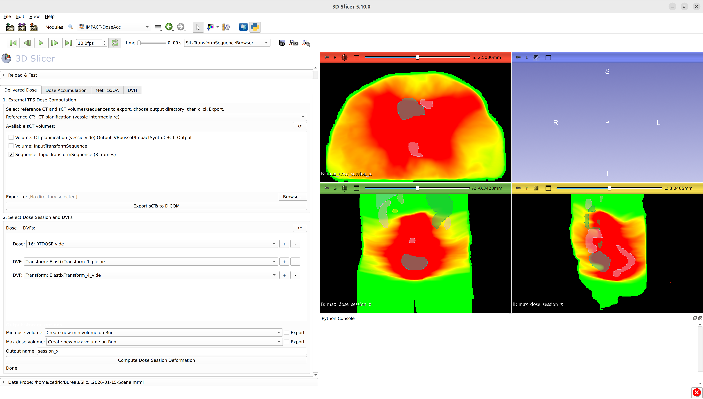
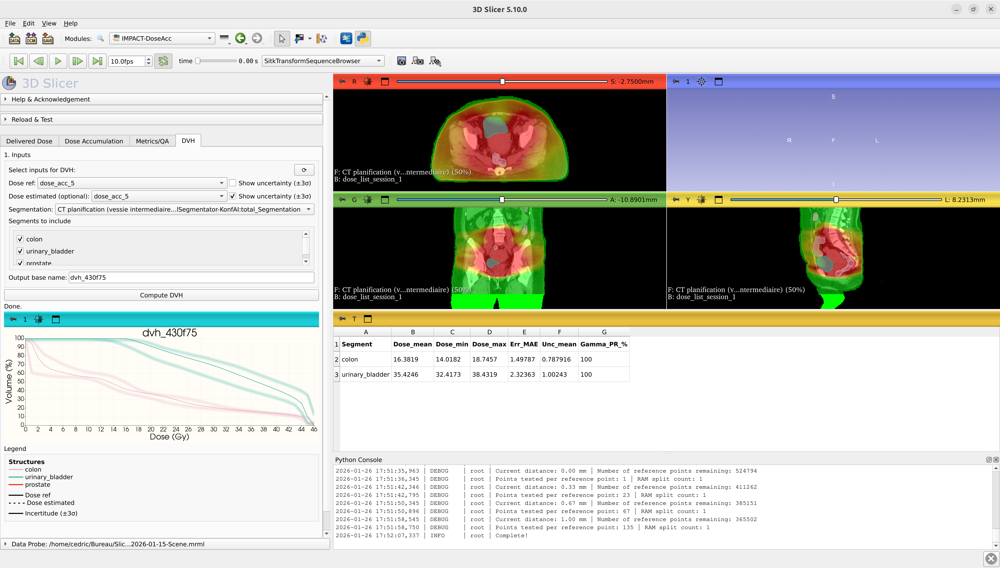
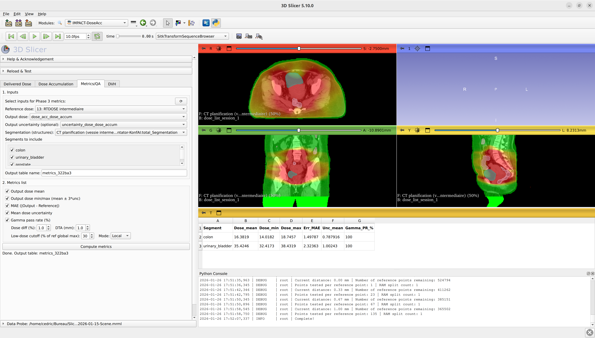

# Slicer IMPACT-DoseAcc


[](LICENSE)

## Overview

IMPACT-DoseAcc is a 3D Slicer extension for dose accumulation and uncertainty quantification in radiotherapy. It is organized into four workflow phases:

- **Phase 1 - Prescription**: prepare reference volumes, sessions, and export options.
- **Phase 2 - Accumulation**: accumulate dose with optional uncertainty handling.
- **Phase 3 - Metrics**: compute MAE, gamma pass rates, and summary statistics.
- **Phase 4 - DVH**: generate per‑segment DVHs with optional uncertainty traces.

## Demo Video

Coming soon.

## Figures

Example visualizations are available in the `docs/` folder:

<p align="center">
  
  
</p>

<p align="center">
  
  
</p>

## Requirements

- **3D Slicer** (recent 5.x recommended)
- **SlicerRT** for gamma computation (DoseComparison module)
- Optional: `matplotlib` for PNG export of DVH plots

Most scientific Python dependencies (`numpy`, `vtk`, etc.) are bundled with Slicer.

## Installation

### Load as a local module

1. Clone the repository:

```bash
git clone https://github.com/vboussot/SlicerImpactDoseAcc.git
```

2. In Slicer: `Edit → Application Settings → Modules → Additional module paths`
3. Add the `ImpactDoseAcc` folder (inside this repo) and restart Slicer.


## Quick Start

1. **Prescription**: choose the reference CT, select dose(s) and DVF(s), and set output name.
2. **Accumulation**: select sessions, choose a strategy, and compute the accumulated dose.
3. **Metrics**: compute MAE, gamma, and uncertainty summaries.
4. **DVH**: select segments and generate plots/tables.

## Outputs (default names)

Depending on the options chosen, the module writes:

- `dose_list_<name>` (mean dose)
- `min_dose_<name>` / `max_dose_<name>`
- `uncertainty_dose_<name>`
- `dvf_magnitude_<name>`

## Contributing

- Open an issue to discuss changes or feature requests
- Submit focused pull requests with a clear description

## License

This project is distributed under the **Apache License 2.0**. See `LICENSE`.


